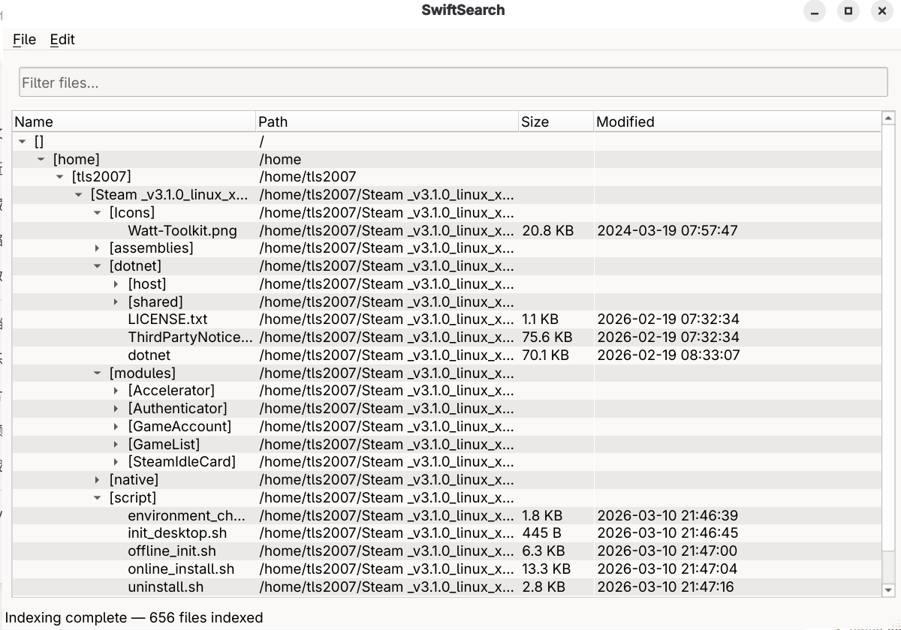
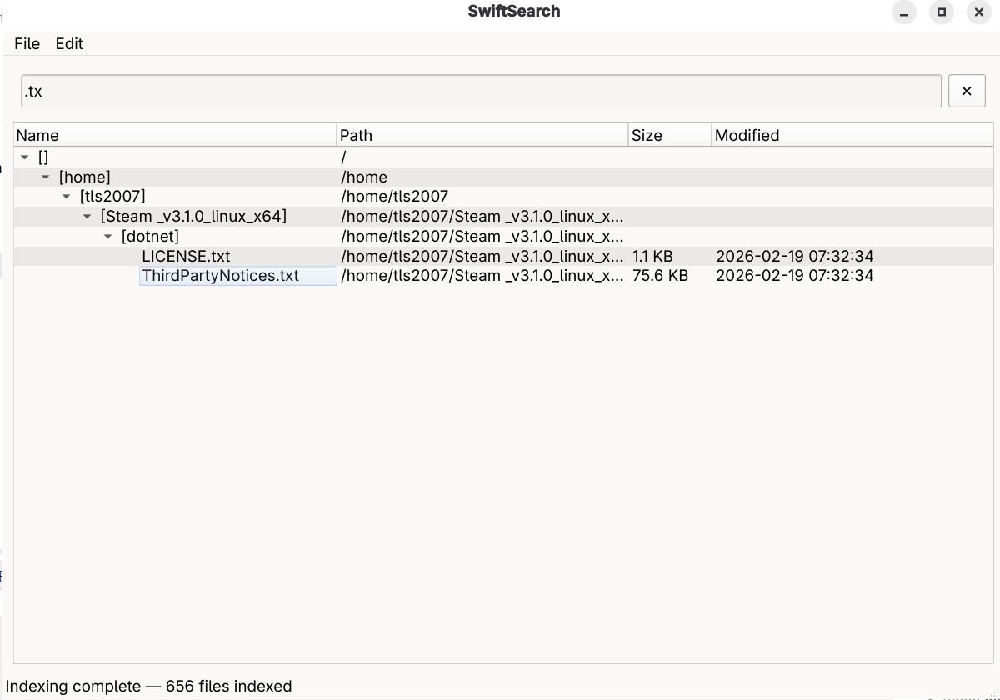

# SwiftSearch

[](https://en.cppreference.com/w/cpp/23)
[](https://www.qt.io/)
[](https://cmake.org/)
[]()
[](./LICENSE)

**High-Performance Cross-Platform Desktop File Search Utility**

> [!WARNING]
> **This is a course project. NOT recommended for production use. Use as a small utility tool only.**

> [!NOTE]
> **This project was co-developed using [opencode](https://github.com/anomalyco/opencode) and DeepSeek v4 pro.**

---

## Table of Contents

- [⚠️ Warning](#️-warning)
- [📝 Development Note](#-development-note)
- [Features](#features)
- [Screenshots](#screenshots)
- [Quick Start](#quick-start)
- [Build from Source](#build-from-source)
- [Usage](#usage)
- [Configuration](#configuration)
- [Architecture](#architecture)
- [Project Structure](#project-structure)
- [Packaging](#packaging)
- [Running Tests](#running-tests)
- [License](#license)

---

## ⚠️ Warning

**This project is a coursework assignment.** It is NOT intended for production environments. Feel free to use it as a small utility tool, but do not rely on it for critical tasks. There are no guarantees of stability, security, or long-term maintenance.

## 📝 Development Note

This project was co-developed using **[opencode](https://github.com/anomalyco/opencode)** — an interactive CLI coding assistant — together with **DeepSeek v4 pro** as the underlying language model.

---

## Features

- **SQLite-Powered Indexing** — Fast recursive file system indexing with WAL journal mode and batch transactions
- **Real-Time File Watching** — Detects file changes automatically via `inotify` on Linux and NTFS USN Journal on Windows
- **Relevance Ranking** — Search results scored by exact match (10.0), prefix match (8.0), wildcard (6.0), and substring (3.0) with filename boosting
- **Tree-View Browsing** — Hierarchical directory tree for intuitive exploration of indexed files
- **Right-Click Context Menu** — Open file, open file location, copy path, copy directory path, and delete from index
- **Undo / Redo** — All file operations support undo (Ctrl+Z) and redo (Ctrl+Shift+Z) via the Command pattern
- **Real-Time Filtering** — Wildcard-based filtering (`*` and `?`), substring matching, and search-as-you-type
- **Chinese Localization** — Full zh_CN translation, auto-detected from system locale
- **Cross-Platform Packaging** — DEB / RPM / TGZ on Linux, NSIS / ZIP on Windows via CPack

---

## Screenshots

> **Note:** Screenshots to be added. Place your images in `docs/screenshots/`.

### Main Window



### Search Results & Filtering



---

## Quick Start

### Prerequisites

| Dependency       | Version    | Notes                                     |
|------------------|------------|-------------------------------------------|
| CMake            | ≥ 3.16     |                                           |
| C++ Compiler     | GCC ≥ 14 / MSVC 2022 / MinGW | C++23 support required      |
| Qt6              | ≥ 6.5      | Core, Gui, Widgets, Sql, Concurrent       |
| Ninja (Linux)    | any        | Recommended; also supports Unix Makefiles |
| Visual Studio    | 2022       | Required on Windows                       |
| GTest            | auto-fetched | v1.15.2 fetched via FetchContent         |

### One-Line Build

```bash
# Linux (Release)
cmake --preset release-linux && cmake --build --preset release-linux
```

```powershell
# Windows (Release, PowerShell)
cmake --preset release-windows
cmake --build --preset release-windows
```

The built binary will be at:
- **Linux:** `build/release-linux/src/SwiftSearch`
- **Windows:** `build/release-windows/src/Release/SwiftSearch.exe`

---

## Build from Source

### Linux

```bash
# Configure (Ninja, Release)
cmake --preset release-linux

# Build
cmake --build --preset release-linux

# Or use the build script
./scripts/build_linux_release.sh
```

For a debug build with tests:

```bash
cmake --preset debug-linux
cmake --build --preset debug-linux
```

### Windows

```powershell
# Configure (Visual Studio 2022, Release)
cmake --preset release-windows

# Build
cmake --build --preset release-windows

# Or use the build script
.\scripts\build_windows_release.ps1
```

### Build Options

| Option                  | Default | Description              |
|-------------------------|---------|--------------------------|
| `BUILD_TESTS`           | ON      | Build unit test targets  |
| `SWIFTSEARCH_WERROR`    | OFF     | Treat warnings as errors |

Pass options with `-D`:

```bash
cmake -B build -G Ninja -DBUILD_TESTS=OFF -DSWIFTSEARCH_WERROR=ON
```

---

## Usage

1. **Launch** the application — it automatically indexes the default directory
2. **Index** additional directories via `File → Index Directory`
3. **Search** by typing in the filter bar; results appear in the tree view below
4. **Browse** the hierarchical file tree to explore indexed files
5. **Right-click** any file for context actions:
   - Open File
   - Open File Location
   - Copy Path / Copy Directory Path
   - Delete from Index
6. **Undo** any file operation with Ctrl+Z; redo with Ctrl+Shift+Z
7. **Configure** settings via `File → Settings`
8. **Filter** results in real time with wildcards (`*.cpp`, `test*`, `?ile`)

---

## Configuration

All settings are persisted via `QSettings` and can be modified in `File → Settings`:

| Setting                  | Description                                           |
|--------------------------|-------------------------------------------------------|
| Default Index Directory  | Directory indexed automatically on startup            |
| Database Path            | Where the SQLite index file is stored                 |
| Max Scan Depth           | Maximum directory depth for recursive scanning        |
| Max Search Results       | Limit on returned search results (10–10000)           |
| Case-Sensitive Search    | Toggle case sensitivity for search queries            |

---

## Architecture

SwiftSearch follows a layered **Model-View-Controller (MVC)** architecture:

```
┌─────────────────────────────────────────────────┐
│                     View                        │
│  main_window / search_bar / result_list /       │
│  settings_dialog                                │
├──────────────────────┬──────────────────────────┤
│     Controller       │        Model             │
│  search_service      │  file_entry              │
│  query_parser        │  file_scanner            │
│  result_ranker       │  index_database          │
│  search_filter       │  index_engine            │
│  file_command        │  platform_handles        │
│  command_history     │  indexing_observer       │
├──────────────────────┴──────────────────────────┤
│                     Util                        │
│  log_manager / sort_util                        │
└─────────────────────────────────────────────────┘
```

### Tech Stack

| Layer        | Technology                                              |
|--------------|---------------------------------------------------------|
| Language     | C++23                                                   |
| UI           | Qt6 (Widgets)                                           |
| Database     | SQLite via Qt6::Sql                                     |
| Concurrency  | Qt6::Concurrent (QFutureWatcher, QtConcurrent::run)     |
| Build        | CMake 3.16+ with Ninja / Visual Studio                  |
| Testing      | Google Test 1.15.2                                      |
| Packaging    | CPack                                                   |
| Logging      | Custom singleton logger with auto-rotation              |

### Design Patterns

| Pattern       | Usage                                              |
|---------------|----------------------------------------------------|
| Observer      | Indexing / search progress callbacks               |
| Command       | Undoable file operations routed through history    |
| Singleton     | Thread-safe LogManager                             |
| RAII          | Platform handles (Win32, inotify, DIR*)            |
| Pipeline      | C++20 ranges views for filtering & sorting         |

---

## Project Structure

```
SwiftSearch/
├── CMakeLists.txt              # Root build configuration
├── CMakePresets.json           # Presets (Debug/Release × Linux/Windows)
├── main.cpp                    # Application entry point
├── cmake/                      # CMake modules
│   ├── CompilerWarnings.cmake  # Strict warning flags
│   └── PlatformConfig.cmake    # OS-specific build settings
├── src/
│   ├── CMakeLists.txt
│   ├── model/                  # Data & filesystem operations
│   ├── controller/             # Search logic, commands, ranking
│   ├── view/                   # Qt widgets & main window
│   └── util/                   # Logging, sorting utilities
├── resources/
│   ├── resources.qrc
│   ├── icons/                  # Application icon
│   └── translations/           # zh_CN translation files
├── scripts/                    # Build & packaging scripts
├── tests/                      # Google Test unit tests
└── docs/
    └── screenshots/            # Screenshot images
```

---

## Packaging

### Linux

```bash
./scripts/build_linux_release.sh
```

Generates:
- `SwiftSearch-1.0.0-Linux.deb` (requires `dpkg-dev`)
- `SwiftSearch-1.0.0-Linux.rpm` (requires `rpm-build`)
- `SwiftSearch-1.0.0-Linux.tar.gz`

### Windows

```powershell
.\scripts\build_windows_release.ps1
```

Generates:
- `SwiftSearch-1.0.0-win64.exe` (NSIS installer)
- `SwiftSearch-1.0.0-win64.zip`

---

## Running Tests

```bash
# Configure & build debug preset
cmake --preset debug-linux
cmake --build --preset debug-linux

# Run tests
ctest --preset debug-linux
```

Or manually:

```bash
ctest --test-dir build/debug-linux --output-on-failure
```

---

## License

This project is licensed under the **GNU General Public License v3.0 (GPLv3)**.

Note that Qt6 is also available under GPLv3 / LGPLv3. When linking against Qt under GPLv3, your combined work must comply with the terms of that license.

---

---

# SwiftSearch

[](https://en.cppreference.com/w/cpp/23)
[](https://www.qt.io/)
[](https://cmake.org/)
[]()
[](./LICENSE)

**高性能跨平台桌面文件搜索工具**

> [!WARNING]
> **本项目为课设作品，极不推荐用于生产环境，当个小工具即可。**

> [!NOTE]
> **本项目使用 [opencode](https://github.com/anomalyco/opencode) 与 DeepSeek v4 pro 共同开发完成。**

---

## 目录

- [⚠️ 警告](#️-警告-1)
- [📝 开发说明](#-开发说明-1)
- [功能特性](#功能特性)
- [截图](#截图)
- [快速开始](#快速开始)
- [从源码构建](#从源码构建)
- [使用方法](#使用方法)
- [配置说明](#配置说明)
- [架构设计](#架构设计)
- [项目结构](#项目结构)
- [打包发布](#打包发布)
- [运行测试](#运行测试)
- [许可证](#许可证)

---

## ⚠️ 警告

**本项目为课设作品。** 不适用于生产环境，切勿用于关键任务。可当小工具随意使用，但不保证稳定性、安全性或长期维护。

## 📝 开发说明

本项目使用 **[opencode](https://github.com/anomalyco/opencode)** — 交互式命令行编程助手 — 配合 **DeepSeek v4 pro** 大语言模型共同开发完成。

---

## 功能特性

- **基于 SQLite 的高速索引** — 采用 WAL 日志模式与批量事务，快速递归索引文件系统
- **实时文件监控** — Linux 下使用 `inotify`、Windows 下使用 NTFS USN Journal 自动检测文件变化
- **搜索结果排序** — 精确匹配 (10.0)、前缀匹配 (8.0)、通配符匹配 (6.0)、子串匹配 (3.0)，文件名权重加倍
- **树状结构浏览** — 层次化目录树，直观浏览已索引的文件
- **右键上下文菜单** — 打开文件、打开所在文件夹、复制路径、复制目录路径、从索引中删除
- **撤销 / 重做** — 基于命令模式，所有文件操作支持 Ctrl+Z 撤销、Ctrl+Shift+Z 重做
- **实时过滤** — 支持通配符 (`*`、`?`) 过滤、子串匹配和边输入边搜索
- **中文界面** — 完整 zh_CN 汉化，随系统语言自动切换
- **跨平台打包** — Linux 支持 DEB / RPM / TGZ，Windows 支持 NSIS 安装程序 / ZIP 压缩包

---

## 截图

> **注意：** 截图待补充。请将图片放入 `docs/screenshots/` 目录。

### 主窗口


### 搜索结果与过滤


---

## 快速开始

### 运行环境

| 依赖项           | 版本            | 说明                                   |
|------------------|-----------------|----------------------------------------|
| CMake            | ≥ 3.16          |                                        |
| C++ 编译器       | GCC ≥ 14 / MSVC 2022 / MinGW | 需支持 C++23               |
| Qt6              | ≥ 6.5           | Core、Gui、Widgets、Sql、Concurrent    |
| Ninja (Linux)    | 任意            | 推荐；也支持 Unix Makefiles            |
| Visual Studio    | 2022            | Windows 必需                           |
| GTest            | 自动拉取        | 通过 FetchContent 获取 v1.15.2         |

### 一行构建

```bash
# Linux (Release)
cmake --preset release-linux && cmake --build --preset release-linux
```

```powershell
# Windows (Release, PowerShell)
cmake --preset release-windows
cmake --build --preset release-windows
```

构建产物位置：
- **Linux:** `build/release-linux/src/SwiftSearch`
- **Windows:** `build/release-windows/src/Release/SwiftSearch.exe`

---

## 从源码构建

### Linux

```bash
# 配置 (Ninja, Release)
cmake --preset release-linux

# 编译
cmake --build --preset release-linux

# 或使用构建脚本
./scripts/build_linux_release.sh
```

若需 Debug 版本并启用测试：

```bash
cmake --preset debug-linux
cmake --build --preset debug-linux
```

### Windows

```powershell
# 配置 (Visual Studio 2022, Release)
cmake --preset release-windows

# 编译
cmake --build --preset release-windows

# 或使用构建脚本
.\scripts\build_windows_release.ps1
```

### 构建选项

| 选项                    | 默认值 | 说明               |
|-------------------------|--------|--------------------|
| `BUILD_TESTS`           | ON     | 编译单元测试目标   |
| `SWIFTSEARCH_WERROR`    | OFF    | 将警告视为错误     |

通过 `-D` 传递选项：

```bash
cmake -B build -G Ninja -DBUILD_TESTS=OFF -DSWIFTSEARCH_WERROR=ON
```

---

## 使用方法

1. **启动**应用程序 — 自动索引默认目录
2. **索引**更多目录：`File → Index Directory`
3. **搜索**文件：在过滤栏输入关键字，结果将显示在下方树状视图中
4. **浏览**层次化文件树，探索已索引的文件
5. **右键**任意文件可执行操作：
   - 打开文件
   - 打开文件所在位置
   - 复制路径 / 复制目录路径
   - 从索引中删除
6. **撤销**文件操作：Ctrl+Z；重做：Ctrl+Shift+Z
7. **配置**设置：`File → Settings`
8. **实时过滤**：支持通配符 (`*.cpp`、`test*`、`?ile`)

---

## 配置说明

所有设置通过 `QSettings` 持久化存储，可在 `File → Settings` 修改：

| 设置项               | 说明                           |
|----------------------|--------------------------------|
| 默认索引目录         | 启动时自动索引的目录           |
| 数据库路径           | SQLite 索引文件的存放位置      |
| 最大扫描深度         | 递归扫描的最大目录层级         |
| 最大搜索结果数       | 搜索返回结果上限 (10–10000)    |
| 区分大小写搜索       | 是否区分英文大小写             |

---

## 架构设计

SwiftSearch 采用分层 **MVC (Model-View-Controller)** 架构：

```
┌─────────────────────────────────────────────────┐
│                   View (视图)                    │
│  main_window / search_bar / result_list /       │
│  settings_dialog                                │
├──────────────────────┬──────────────────────────┤
│    Controller (控制器) │        Model (模型)      │
│  search_service      │  file_entry              │
│  query_parser        │  file_scanner            │
│  result_ranker       │  index_database          │
│  search_filter       │  index_engine            │
│  file_command        │  platform_handles        │
│  command_history     │  indexing_observer       │
├──────────────────────┴──────────────────────────┤
│                  Util (工具)                     │
│  log_manager / sort_util                        │
└─────────────────────────────────────────────────┘
```

### 技术栈

| 层次         | 技术                                                    |
|--------------|---------------------------------------------------------|
| 编程语言     | C++23                                                   |
| UI 框架      | Qt6 (Widgets)                                           |
| 数据库       | SQLite，通过 Qt6::Sql 驱动                              |
| 并发处理     | Qt6::Concurrent (QFutureWatcher, QtConcurrent::run)     |
| 构建系统     | CMake 3.16+，配合 Ninja 或 Visual Studio                |
| 单元测试     | Google Test 1.15.2                                      |
| 打包发布     | CPack                                                   |
| 日志系统     | 自定义单例日志器，支持自动轮转                           |

### 设计模式

| 模式         | 用途                                        |
|--------------|---------------------------------------------|
| 观察者       | 索引 / 搜索进度回调                         |
| 命令         | 可撤销的文件操作，通过历史管理器统一管理     |
| 单例         | 线程安全的 LogManager                       |
| RAII         | 平台句柄封装 (Win32, inotify, DIR*)         |
| 管道         | C++20 ranges 视图组合过滤与排序             |

---

## 项目结构

```
SwiftSearch/
├── CMakeLists.txt              # 根构建配置
├── CMakePresets.json           # 预设 (Debug/Release × Linux/Windows)
├── main.cpp                    # 应用程序入口
├── cmake/                      # CMake 模块
│   ├── CompilerWarnings.cmake  # 严格警告标志
│   └── PlatformConfig.cmake    # 操作系统相关设置
├── src/
│   ├── CMakeLists.txt
│   ├── model/                  # 数据模型与文件系统操作
│   ├── controller/             # 搜索逻辑、命令、排序
│   ├── view/                   # Qt 控件与主窗口
│   └── util/                   # 日志、排序工具
├── resources/
│   ├── resources.qrc
│   ├── icons/                  # 应用图标
│   └── translations/           # 中文本地化翻译文件
├── scripts/                    # 构建与打包脚本
├── tests/                      # Google Test 单元测试
└── docs/
    └── screenshots/            # 截图图片
```

---

## 打包发布

### Linux

```bash
./scripts/build_linux_release.sh
```

生成产物：
- `SwiftSearch-1.0.0-Linux.deb` (需安装 `dpkg-dev`)
- `SwiftSearch-1.0.0-Linux.rpm` (需安装 `rpm-build`)
- `SwiftSearch-1.0.0-Linux.tar.gz`

### Windows

```powershell
.\scripts\build_windows_release.ps1
```

生成产物：
- `SwiftSearch-1.0.0-win64.exe` (NSIS 安装程序)
- `SwiftSearch-1.0.0-win64.zip`

---

## 运行测试

```bash
# 配置并编译 Debug 预设
cmake --preset debug-linux
cmake --build --preset debug-linux

# 运行测试
ctest --preset debug-linux
```

或手动执行：

```bash
ctest --test-dir build/debug-linux --output-on-failure
```

---

## 许可证

本项目使用 **GNU 通用公共许可证 v3.0 (GPLv3)**。

请注意，Qt6 同样遵循 GPLv3 / LGPLv3 许可。当您在 GPLv3 下链接 Qt 时，合并后的作品须遵守该许可证的条款。
